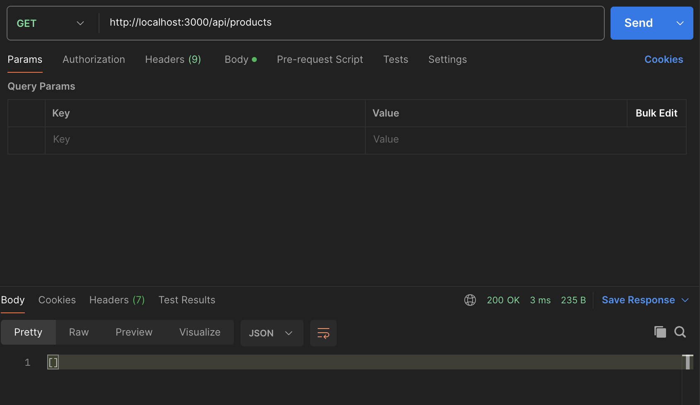
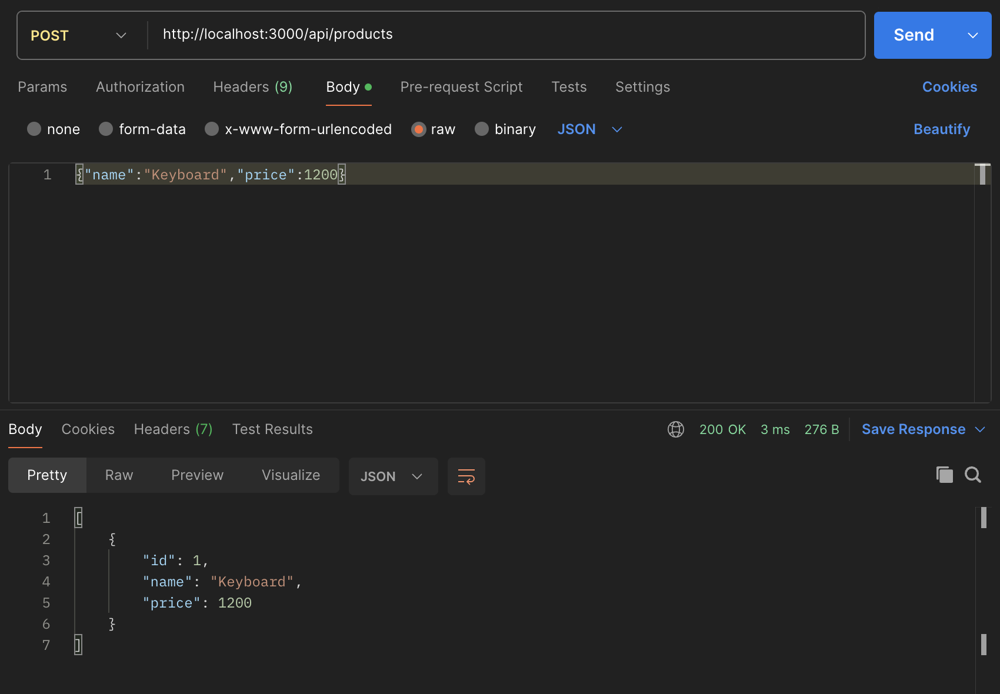
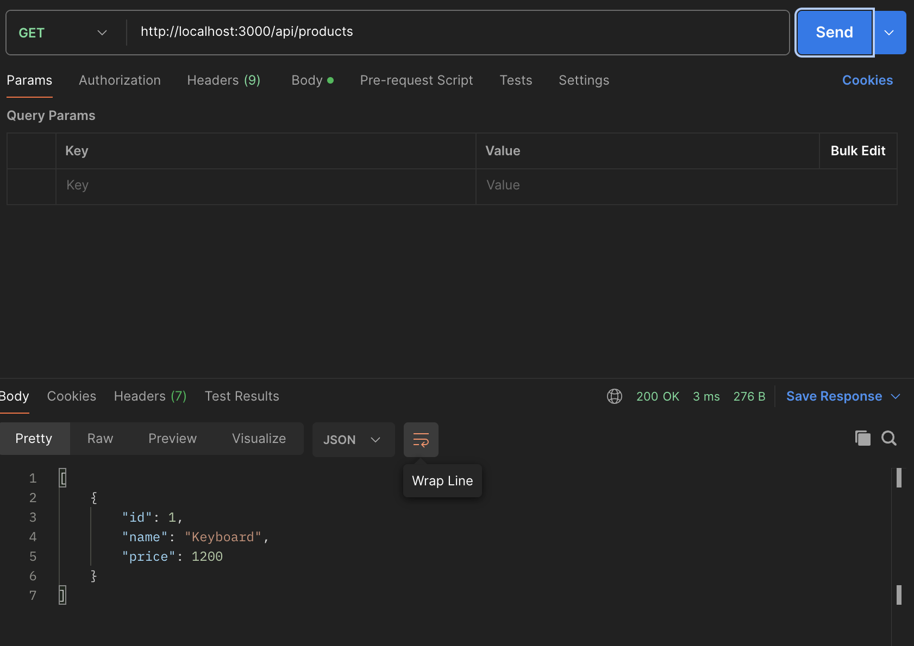

# Product Management API

## Architecture
This project uses Layered Architecture (3-Tier)

- Presentation Layer: Routes, Controllers
- Business Layer: Services, Validators
- Data Layer: Repository, SQLite Database

## Run
npm install
node server.js

## Test

## GET

## POST

## Result
